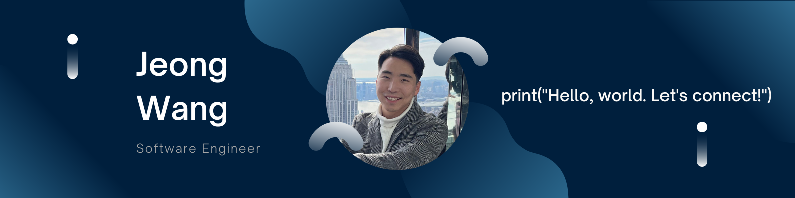

<!--
**jeongwang95/jeongwang95** is a ✨ _special_ ✨ repository because its `README.md` (this file) appears on your GitHub profile.

Here are some ideas to get you started:

- 🔭 I’m currently working on ...
- 🌱 I’m currently learning ...
- 👯 I’m looking to collaborate on ...
- 🤔 I’m looking for help with ...
- 💬 Ask me about ...
- 📫 How to reach me: ...
- 😄 Pronouns: ...
- ⚡ Fun fact: ...
-->
#### About Me:
Graduated from University of Maryland with a degree in Computer Science. 
My favorite language is python. My favorite Framework and Library are Flask and React. 
In my free time, I enjoy staying active through rock climbing and golfing, and I am always on the lookout for new restaurants to try. 
Connect with me on [LinkedIn](https://www.linkedin.com/in/jeongwang/). I am open to new opportunities! 

#### I am:
* Currently working on [lftovrs_frontend](https://github.com/jeongwang95/lftovrs_frontend). 
* The creator of lftovrs: a food recipe web application. ([frontend](https://github.com/jeongwang95/lftovrs_frontend), [backend](https://github.com/jeongwang95/lftovrs)). 
* Currently learning Redux Toolkit and JavaScript Promise. 

#### Programming Langauges:

#### Frameworks/Libraries:

#### Databases:

#### Additional Tools:

